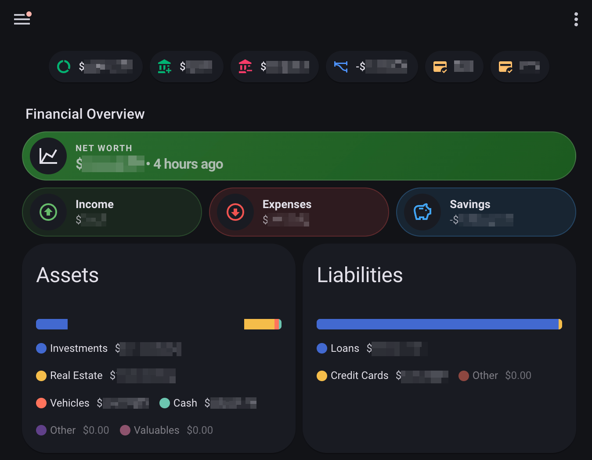
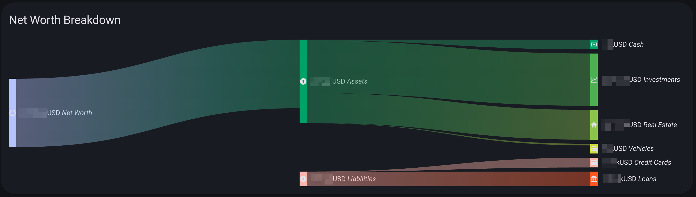
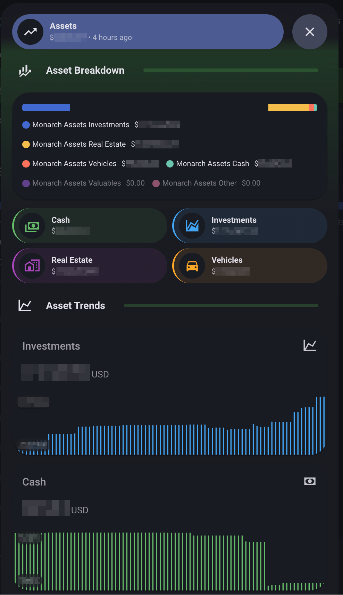
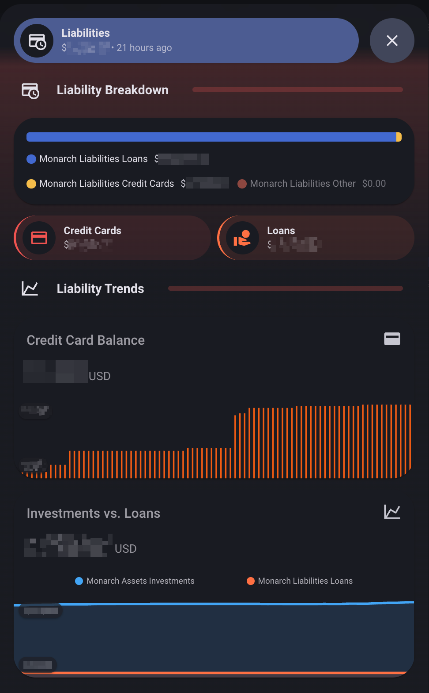
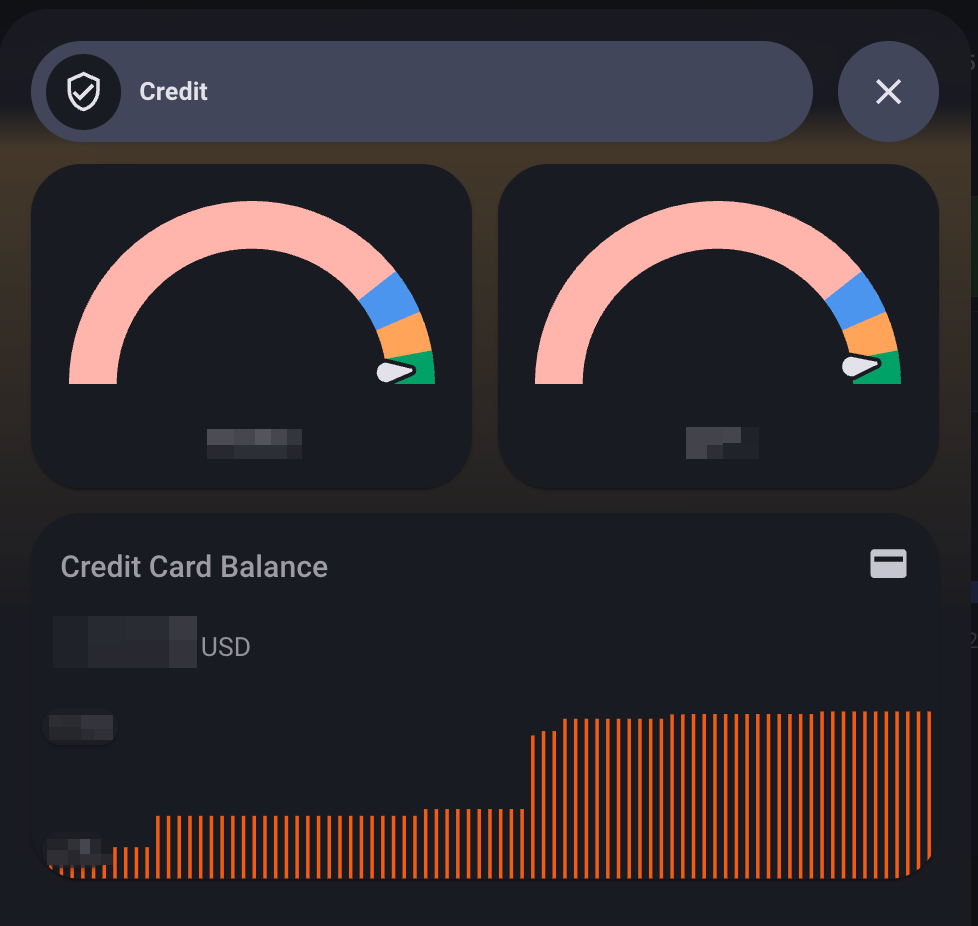
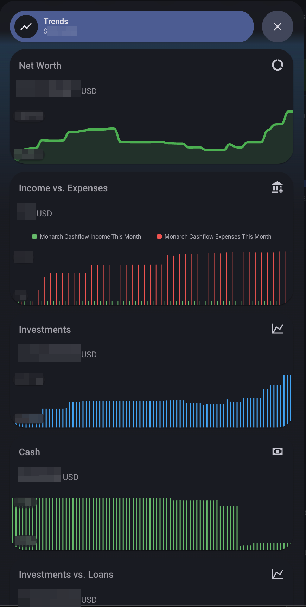
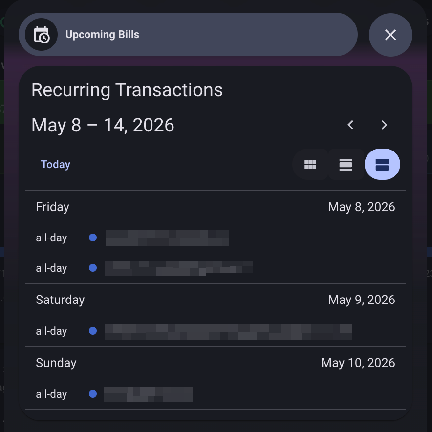
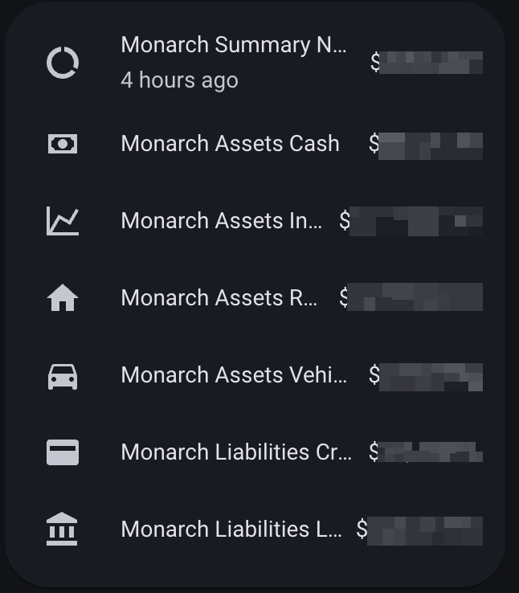

# Monarch for Home Assistant

[](https://github.com/hacs/integration) [](https://github.com/sanghviharshit/ha-monarchmoney/releases/latest) [](https://opensource.org/licenses/MIT)

**Integration for [Monarch Money](https://www.monarchmoney.com/referral/craudhiyod) in [Home Assistant](https://www.home-assistant.io/)**

Track all your Monarch Money financial data - account balances, net worth, cash flow, investments, and more - directly in Home Assistant.

## Features

- **Account sensors** - balances grouped by type (Cash, Credit Cards, Investments, Loans, Real Estate, Vehicles, Valuables, etc.)
- **Net Worth sensor** - total net worth with assets/liabilities breakdown
- **Cash Flow sensor** - monthly savings, income, and expenses with savings rate
- **Income & Expense sensors** - totals with per-category breakdowns
- **Credit Score sensors** *(optional)* - per household member, with score history and change tracking
- **Investment Holdings sensors** *(optional)* - individual securities with price, quantity, cost basis, and gain/loss
- **Recurring Transactions calendar** *(optional)* - upcoming bills and subscriptions as calendar events
- **Recent Transactions sensor** *(optional)* - most recent transactions (configurable count), with merchant/category/account/amount as attributes
- **Refresh button** - manually trigger a data refresh
- **MFA support** - manual code entry or automatic TOTP via secret key

## Installation

### HACS (Recommended)

1. In HACS, go to **Integrations** and click **+**.
2. Search for **Monarch** and install.
3. Restart Home Assistant.

### Manual

1. Copy the `custom_components/monarchmoney` folder to your Home Assistant `custom_components` directory.
2. Restart Home Assistant.

## Setup

1. Go to **Settings > Devices & Services > Add Integration**.
2. Search for **Monarch** and follow the prompts.
3. Log in with your Monarch Money email and password. If MFA is enabled, you'll be prompted for your code (or provide your TOTP secret for automatic MFA).

## Configuration

After setup, go to the integration's **Options** to configure:

| Option | Default | Description |
|---|---|---|
| Scan interval (minutes) | 60 (1hr) | How often to poll Monarch's API (60, 120, 240, 360, 720, 1440) |
| Timeout (seconds) | 30 | API request timeout (10, 15, 30, 45, 60) |
| Credit score | Off | Enable credit score sensors |
| Investment holdings | Off | Enable per-security holding sensors |
| Aggregated holdings | Off | Enable aggregated investment holdings across accounts |
| Recurring transactions | Off | Enable recurring transactions calendar |
| Recent transactions | Off | Enable recent transactions sensor |
| Recent transactions count | 10 | How many recent transactions to fetch (10, 25, 50, 100) |

## Full transaction history

The "Recent Transactions" sensor only ever holds its configured count, so it's meant for
at-a-glance dashboard use, not history. For anything beyond that — larger date ranges,
paging through everything, filtering by account — call the `monarchmoney.get_transactions`
action (Developer Tools > Actions, or from a script/automation). It queries Monarch directly
and returns the matching transactions plus a total count, without touching sensor state:

```yaml
action: monarchmoney.get_transactions
data:
  start_date: "2026-01-01"
  end_date: "2026-01-31"
  limit: 500
response_variable: jan_transactions
```

## Screenshots

A multi-tab dashboard built with [Bubble Card](https://github.com/Clooos/Bubble-Card), [mini-graph-card](https://github.com/kalkih/mini-graph-card), and [sankey-chart-card](https://github.com/MindFreeze/ha-sankey-chart). Numbers in screenshots are blurred for privacy.

### Overview (tablet)



### Net Worth Breakdown (sankey)



### Mobile tabs

<p>
  
  
  
  
  
</p>

### Account sensors



A working dashboard YAML using these cards is in [`examples/bubble-card-dashboard.yaml`](examples/bubble-card-dashboard.yaml). It expects the `monarch_credit_score_*` entities to match your household member names; rename them as needed.

## Credits

- [monarchmoneycommunity](https://github.com/bradleyseanf/monarchmoneycommunity) (forked from [monarchmoney](https://github.com/hammem/monarchmoney))
- Dashboard examples use [Bubble Card](https://github.com/Clooos/Bubble-Card), [mini-graph-card](https://github.com/kalkih/mini-graph-card), and [sankey-chart-card](https://github.com/MindFreeze/ha-sankey-chart)
